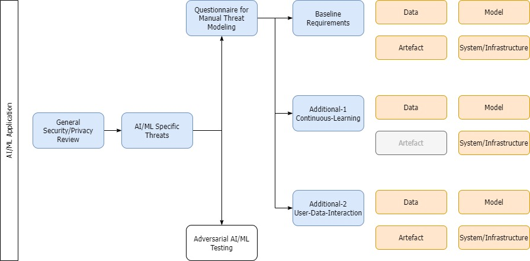
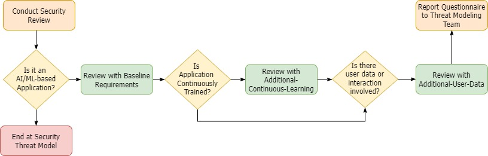

AI Threat Modeling Solution  
<i><b>Questionnaire to identify threats in AI/ML applications </b></i> 
Developed by the Comcast SPIDER Team

## Contents

- [Overview](#overview)
- [Structure](#structure)
- [Usage](#usage)
- [Sources](#sources)
- [License](#license)

## Overview

AI/ML applications have unique security threats. Project GuardRail is a set of security and privacy requirements that AI/ML applications should meet during their design phase that serve as guardrails against these threats. These requirements help scope the threats such applications must be protected against. It consists of a baseline set required for **all** AI/ML applications, and two additional set of requirements that are specific to **continuously learning** models and **user interacting** models respectively. There are four additional questions that are specific to generative AI applications only. 

## Structure
The content of this library comes from a variety of frameworks, lists, and sources, both from academia and industry. We have performed several iterations to refine the library to accurately determine the scope and language of the questions. [Sources](#sources) below provides a list of all such sources that this material is derived from. 

For every application, security and privacy threat models are conducted as usual. 

As shown in the diagram below, the "Questionnaire for Manual Threat Modeling" defines the library. The 53 threats (and 4 additional generative AI threats) are divided into three categories as shown. 

- All AI/ML applications must meet the 28 [./baseline](baseline.md) requirements.   
- If an application is continuously learning, they must meet 6 [additional](./additional-1.md) requirements apart from baseline.
- If they EITHER train on user data OR interact with users, they must meet 19 [additional](./additional-2.md) requirements apart from baseline.

Generative AI questions are differentiated and put into a separate group under each category if applicable.

Each of the requirements are divided into four sub categories - data, model, artefact (output), and system/infrastructure, depending on which element of the ML application a threat is applicable to. 

<b>Data</b> indicates all input information to the model that it trains on. <b>Model</b> indicates the source code of the AI/ML application. <b>Artefact</b> indicates the output of the model, including predictions if applicable. <b>System/infrastructure</b> is the underlying architecture supporting the model functionality, like hardware, for example. 

## Usage
This requirement document can be used as an assessment for both AI/ML applications as well as new third-party AI vendors. After an application undergoes the usual security review process and it is determined that it is not an AI/ML-driven application, the review ends. Otherwise, the application developers can take the baseline assessment. Following this, depending on whether the underlying model fits into the two additional categories outlined above, additional assessment questions can be added. This questionnaire can then be reported to the threat modeling team for review. 

## Sources
- Plot4AI: https://plot4.ai/ 
- NIST AI Risk Management Framework 1.0: https://www.nist.gov/itl/ai-risk-management-framework 
- ETSI GR SAI 004: https://www.etsi.org/deliver/etsi_gr/SAI/001_099/004/01.01.01_60/gr_SAI004v010101p.pdf
- Mauri & Damiani, Modeling Threats to AI-ML Systems Using STRIDE: https://www.mdpi.com/1424-8220/22/17/6662, https://github.com/LaraMauri/STRIDE-AI 
- Microsoft AI/ML Threat Modeling: https://learn.microsoft.com/en-us/security/engineering/threat-modeling-aiml#11-exploit-software-dependencies-of-the-ml-system
- Microsoft + Harvard Failure Modes in Machine Learning https://learn.microsoft.com/en-us/security/engineering/failure-modes-in-machine-learning 
- Gebru et al., Datasheets for Datasets: https://arxiv.org/abs/1803.09010
- Amershi et al., Guidelines for Human-AI Interaction: https://dl.acm.org/doi/10.1145/3290605.3300233
- Kotenko et al., Attacks Against Artificial Intelligence Systems: Classification, The Threat Model and the Approach to Protection: https://link.springer.com/chapter/10.1007/978-3-031-19620-1_28
- MITRE ATLAS: https://atlas.mitre.org/
- Gartner MOST Framework: https://blogs.gartner.com/avivah-litan/2021/01/21/top-5-priorities-for-managing-ai-risk-within-gartners-most-framework/

This repository will be updated as we use additional sources to update the library if required. 

## Contributions 
Contributions and suggestions from the open-source community are welcome. Please refer to the [Contributing.md](CONTRIBUTING.md) document for more information. All contributions must follow the [Comcast Code of Conduct](CODE_OF_CONDUCT.md).

## License

Licensed under the [CC-BY-4.0](https://creativecommons.org/licenses/by/4.0/) license.
